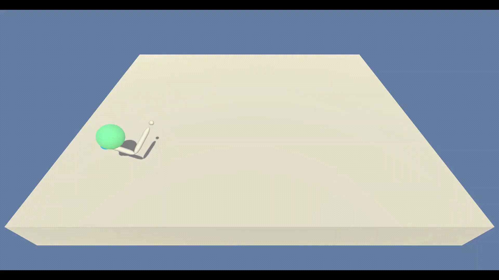
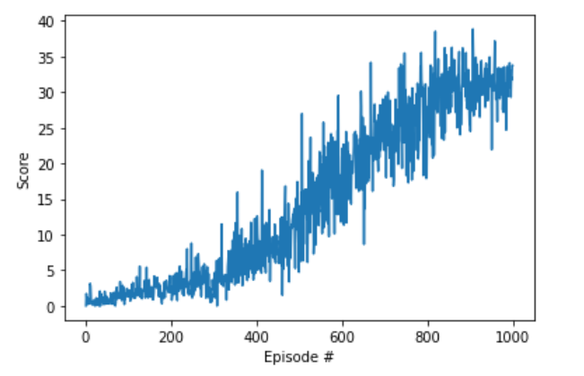
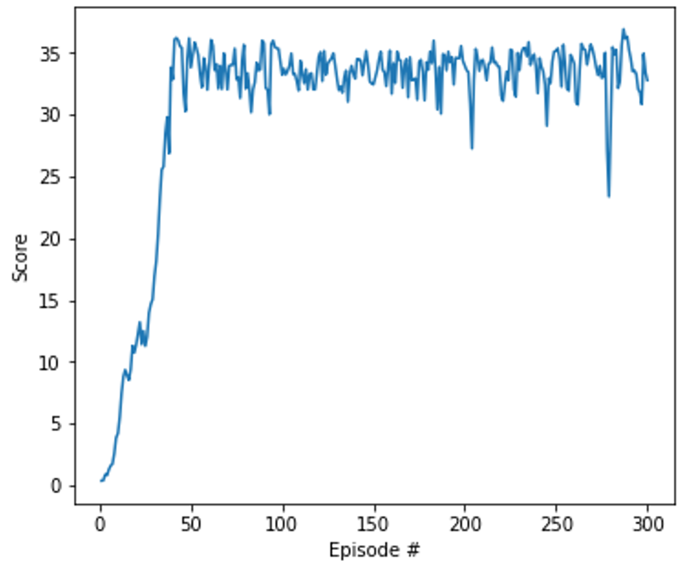

# Deep Reinforcement Learning Algorithms

**Disclaimer:** Udacity provided some starter code, but the implementation for these concepts are done by myself. Please contact derektan95@hotmail.com for any questions.   
**Note:** Please refer to the instructions on how to download the dependencies for these projects [here](https://github.com/derektan95/deep-reinforcement-learning-udacity-nanodegree/blob/master/INSTRUCTIONS.md).

### Certificate of Completion 
https://confirm.udacity.com/XLGDCKNX

## Project Reports
- [Deep Q-Learning](https://github.com/derektan95/deep-reinforcement-learning-udacity-nanodegree/tree/master/p1_navigation)
- [Deep Deterministic Policy Gradient (DDPG)](https://github.com/derektan95/deep-reinforcement-learning-udacity-nanodegree/tree/master/p2_continuous-control)
- [Multi-Agent DDPG](https://github.com/derektan95/deep-reinforcement-learning-udacity-nanodegree/tree/master/p2_continuous-control)

### Summary 
Deep reinforcement learning (deep RL) is a subfield of machine learning that combines reinforcement learning (RL) and deep learning. RL considers the problem of a computational agent learning to make decisions by trial and error. Deep RL incorporates deep learning into the solution, allowing agents to make decisions from unstructured input data without manual engineering of the state space. Deep RL algorithms are able to take in very large inputs (e.g. every pixel rendered to the screen in a video game) and decide what actions to perform to optimize an objective (eg. maximizing the game score). Deep reinforcement learning has been used for a diverse set of applications including but not limited to robotics, video games, natural language processing, computer vision, education, transportation, finance and healthcare [[1]](https://en.wikipedia.org/wiki/Deep_reinforcement_learning). 

The following projects focuses on **model free reinforcement learning**, where the agent has no concept of how its current action will affect its next state. In more technical terms, this family of algorithms do not use the Transition Probability Distribution associated with the Markov Decision Process.

## Introduction to Reinforcement Learning  
In this segment, I was introduced to concepts such as **Markov Decision Process**, **Monte Carlo Methods**, **Temporal-Difference Methods** and **RL in Continous Spaces**. I had the chance to solve some openAI Gym environments, such as [Cliff Walking Env](https://github.com/openai/gym/blob/master/gym/envs/toy_text/cliffwalking.py) and [Taxi-v2 Env](https://gym.openai.com/envs/Taxi-v2/).

## Deep Q-Learning  for Robot Navigation  
This project focuses on the use of **Deep Q-Learning (DQN)** to train an agent to collect yellow bananas while avoiding the purple ones. Here are more information on the [training algorithm](https://github.com/derektan95/deep-reinforcement-learning-udacity-nanodegree/tree/master/p1_navigation) and [project instructions](https://github.com/derektan95/deep-reinforcement-learning-udacity-nanodegree/blob/master/p1_navigation/INSTRUCTIONS.md).

  
  

## Deep Deterministic Policy Gradient for Robot Arm Continuous Control  
This project focuses on the use of **Deep Deterministic Policy Gradient (DDPG)** to train a robotic arm to keep its endeffector on a moving target position. Here are more information on the [training algorithm](https://github.com/derektan95/deep-reinforcement-learning-udacity-nanodegree/tree/master/p2_continuous-control) and [project instructions](https://github.com/derektan95/deep-reinforcement-learning-udacity-nanodegree/blob/master/p2_continuous-control/INSTRUCTIONS.md).

  
  

In addition, the **Distributed Distributional Deterministic Policy Gradients ([D4PG](https://arxiv.org/pdf/1804.08617.pdf))** method was introduced into a multi-arm simulation environment. D4PG utilizes distributional value estimation, n-step returns, prioritized experience replay (PER), distributed K-actor exploration for fast and stable learning. Implementation of PER is omitted as the original paper suggests its lack of efficacy in training speed or stability. 

  
  

## Multi-Agent Deep Deterministic Policy Gradient for Cooperative Tennis  

This project focuses on the use of **Multi-Agent Deep Deterministic Policy Gradient (MADDPG)** to train 2 tennis bats to cooperate with each other in keeping the ball midair for as long as possible. Here are more information on the [training algorithm](https://github.com/derektan95/deep-reinforcement-learning-udacity-nanodegree/tree/master/p3_collab-compet) and [project instructions](https://github.com/derektan95/deep-reinforcement-learning-udacity-nanodegree/blob/master/p3_collab-compet/INSTRUCTIONS.md).

  
  

