# Project 1 Report: Deep Q-Learning for Robot Navigation

## Summary of Content
- [Deep Q-Learning Description](#learning-algorithm)
- [Hyperparameters Chosen](#hyperparameters-chosen)
- [Results](#results)
- [Ideas for Future Work](#ideas-for-future-work)

## Learning Algorithm 
The key learning algorithm used in this project is Deep Q-Learing. We have to first gain a deeper understanding of conventional Reinforcement Learning algorithms before we can better appreciate the use of Deep Q-Learning in solving our robot navigation task. 

### Conventional Q-Learning

Conventional Reinforcement Learning algorithms often involve 2 key stages at each time step. The agent will firstly select an action using the **epsilon-greedy policy** (Policy Improvement),  followed by **updating its Q-table** as it accumulates experience through the epsidoes it has been through (Policy Evaluation). 

  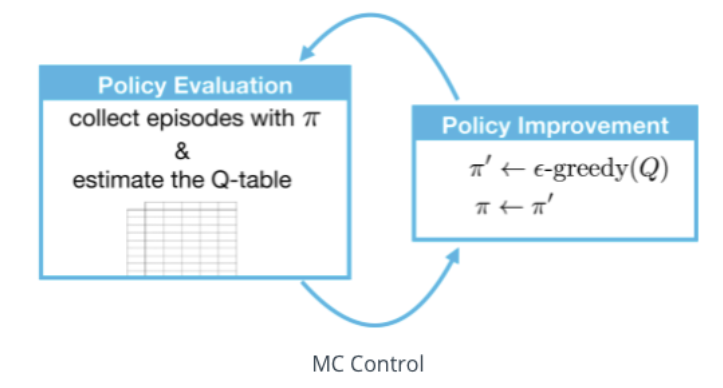

#### Epsilon Greedy Policies (Policy Improvement)
Epsilon Greedy policies balances out the extent to which the agent is exploratory vs exploitative. More specifically, it balances out the agent's desire to explore the environment vs to greedily choose the action that would lead to highest expected cumulative rewards from their current understanding of the world. It is often desirable for the agent to explore the environment more in the early episodes, and to greedily choose actions in the later episodes. An epsilon-greedy policy can be represented by the equation below, assuming that the state space is discrete. 

  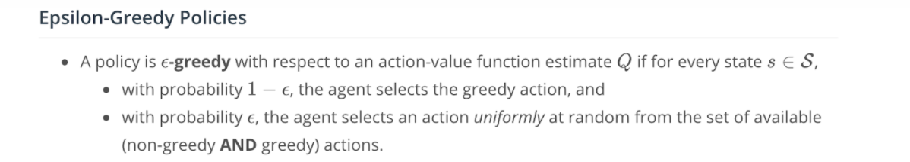
  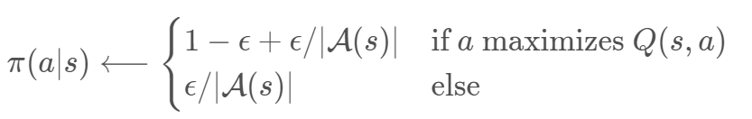

#### Q-Learning (Policy Evaluation)
An agent updates its Q-table by following the equation below. This equation is specific to SARSA-Max, which is also known as Q-Learning. This is considered an **off-policy** method, where the greedy policy that is evaluated and improved is different from the epsilon-greedy policy that is used to select action. 

  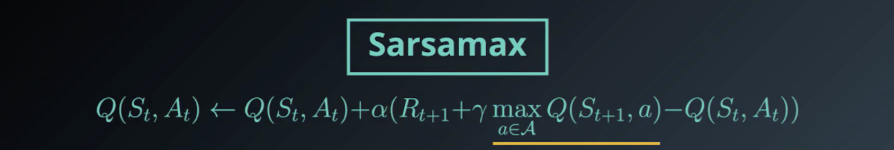

The pseudo-code for SARSA-Max (Q-Learning) is shown in the image below: 

  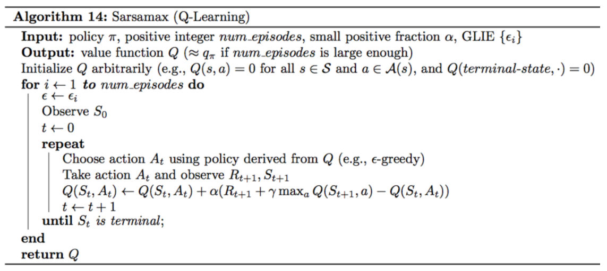

#### Limitations to Conventional RL Approaches
There are some limitations to conventional approaches like SARSA-Max. The main reason why SARSA-Max is rarely used in practice is because it is only meant for agents in discrete state spaces. While we could discretize continuous spaces using methods like tile-coding, it is computationally expensive to compute optimal policies in these large discretized state spaces. There is therefore a need to learn a function approximator to obtain Q-values given the agent's state, through the use of Neural Networks. 

 

### Features of Deep Q-Learning
There are 2 main features of Deep Q-Learning to mitigate training instability arising from its use of Neural Networks. More specifically, Deep Q-Learning uses 
**Experience Replay** and **Fixed Q-Targets** to achieve training stability. 

#### Experience Replay
If we were to naively follow the conventional Q-Learning approach, the agent would learn from consequetive experiences within the same episodes. This can be detrimental if 
the agent were to experience highly correlated tuples (state, action, reward, next_state) that would lead to instability during training. The use of a replay buffer stores experiences obtained from training episodes. These episodes can be randomly sampled anytime for the agent to learn from. Since these episodes are randomized, the agent will end up learning from a diverse set of examples, breaking correlations and experiencing stable training. 

  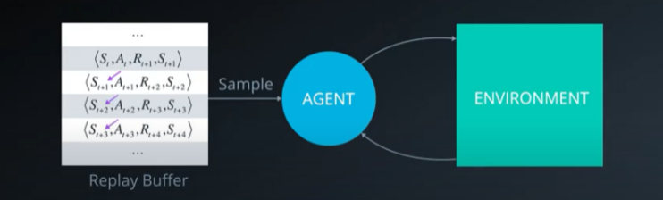

#### Fixed Q-Targets
The agent's objective function is defined to allow our function approximator to be as close to the true optimal policy as possible. We can compute our ideal change in weight parameters using the **Gradient Descent formulation** as shown below. Mathematically, q_pi is not a 1-to-1 replacement for our defined policy update method as they don’t depend on the same parameters. Nevertheless, this allows our function approximator network to learn to grow incrementally towards a better approximation of the optimal policy by 'chasing' the epsilon-greedy policy update.

  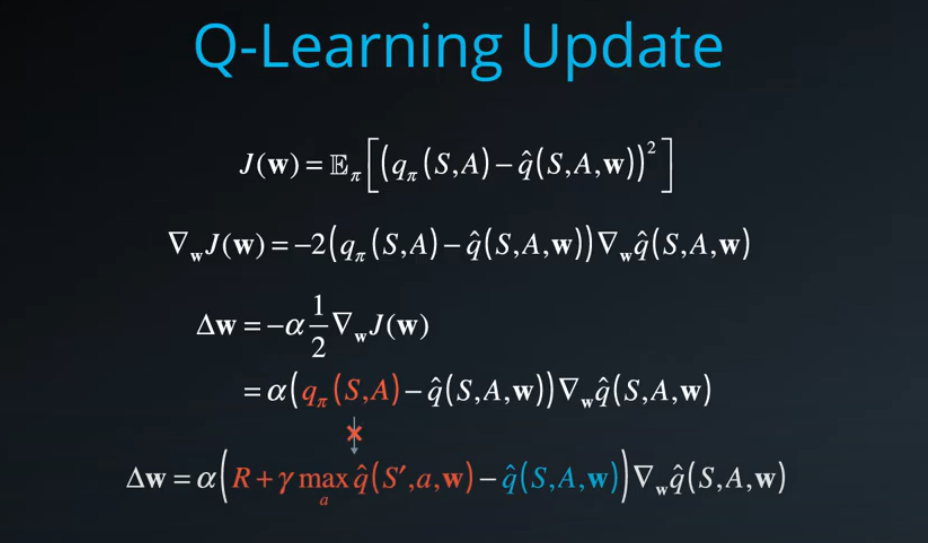

However, since weight parameters are continuously updated to improve our Neural Network derived Q-value, the target itself (epsilon-greedy derived Q-value) continuously changes too. This problem is often described as a car chasing its tail, which leads to high training instability. To fix this, we can introduce a separate neural network that has frozen weights `W(-)`. From time to time, W(-) is copied over from the original neural network W and will then be kept frozen for the original network to chase. This approach generates a stable target for our function approximator to follow.

  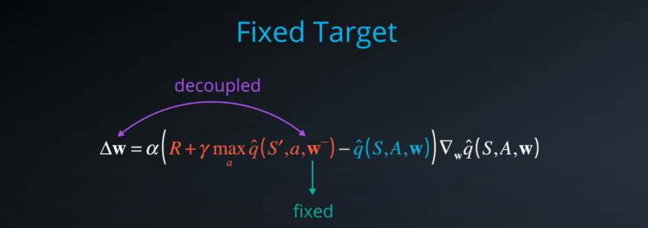

In summary, the Pseudo-code of Deep Q-Learning would look like this: 

  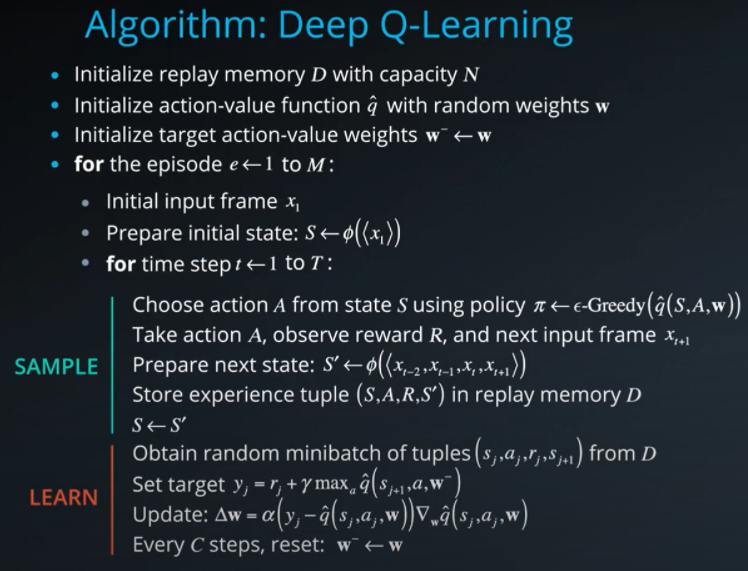

 

### Hyperparameters Chosen
1) **Neural Network Model:** Linear (64) - ReLU - Linear(64) - ReLU - Linear (4)
2) **Episodes:** 1800
3) **Max Duration:** 1000 timesteps  &nbsp;  
4) **Epsilon (Start):** 1.0                 
5) **Epsilon (End):** 0.01                   
6) **Epsilon Decay Rate:** 0.995            
7) **Replay Buffer Size (Max)**: 1e5         
8) **Buffer Batch Size (Sample)**: 64        
9) **Discount Factor (Gamma)**: 0.99        
10) **Target Param Update Rate (Tau)**: 1e-3        
11) **Learning Rate (Optimizer)**: 5e-4       
12) **Update Every (Learning)**: 4

### Results
The results below is obtained from my implementation of Deep Q-Learning for this project. As you can see, training stabilizes early around 800 episodes. Training achieves a **score higher than +13 after 432 episodes** (verify on [notebook](https://github.com/derektan95/deep-reinforcement-learning-udacity-nanodegree/blob/master/p1_navigation/Navigation.ipynb)).

  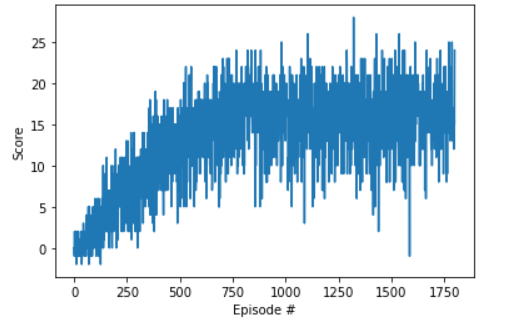

### Ideas for Future Work
There are 2 possible improvements that could be made to the Deep Q-Learning algorithm. 

#### Double DQN
The values in the Q-table are still evolving depending on how much it has been visited. Especially in the early episodes, the highest Q value may not correlate to the best action
to be chosen. Hence, our current approach often overestimate the Q-value since we are always picking the maximum Q-value among a set of noisy Q-values, leading to training instability.

To fix this, we can have a separate set of neural network weights parameters to 'check' with the original set of parameters in the Policy Evaluation step. In other words, both set of function approximators with different weight parameters must agree with each other in order to achieve an overall high Q-value. Conveniently, we can use the frozen target-Q network as the 2nd network. For more information, please refer to this [Research Paper](https://arxiv.org/abs/1509.06461). 

  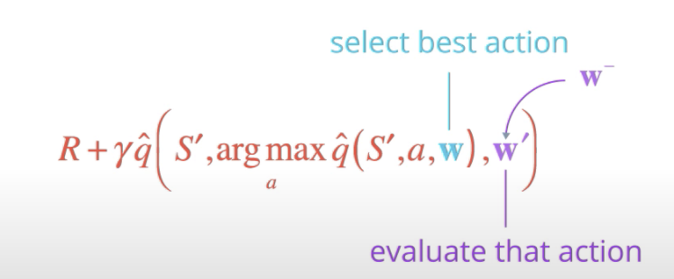

#### Prioritized Experience Replay
There are some experiences in the replay bugger that are considered to be more important than the other. This happens when the Temporal-Difference Error in the Policy Evaluation step gives us a larger difference between the target-Q network and our current local network, implying that there is still alot of learning to be done. We can therefore save such experiences in the replay buffer along with a **priority parameter** represented in the form of a probability value. The overall modifications that have to be made can be seen in the image below. For more information, please refer to this [Research Paper](https://arxiv.org/abs/1511.05952). 

  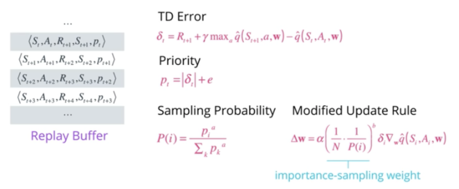

