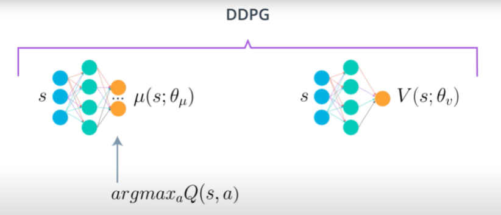
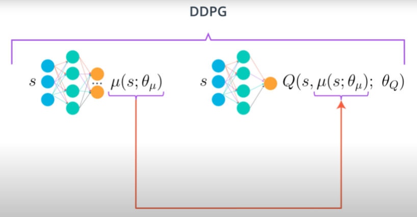
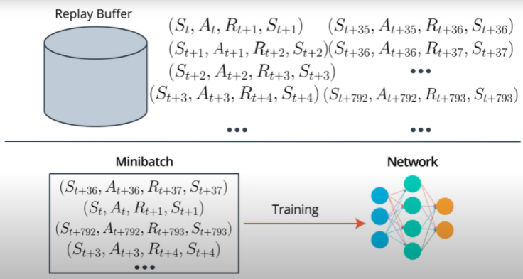
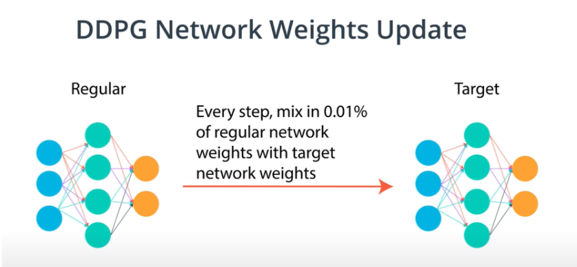
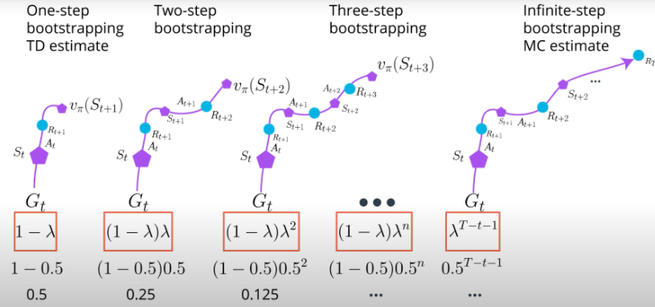

# Project 2 Report: Deep Deterministic Policy Gradients (DDPG) for Robot Arm Continuous Control

## Summary of Content
- [DDPG Description](#learning-algorithm)
- [Hyperparameters Chosen](#hyperparameters-chosen)
- [Results](#results)
- [Ideas for Future Work](#ideas-for-future-work)

## Learning Algorithm 
The key learning algorithm used in this project is Deep Deterministic Policy Gradients (DDPG). We have to first gain a deeper understanding of policy-based networks and actor-critic methods before we can better appreciate the use of DDPG in solving our robotic arm continuous control task. 

### Policy-Based Methods vs Value-Based Methods

With Policy-Based methods, agents directly learn the optimal policy. In other words, policy-based agents simply takes in the state of the environment and decides to take the action that will yield the highest rewards. With Value-Based methods, on the other hand, agents uses its experience with the environment to maintain an estimate of the optimal action-value function. The optimal policy is then obtained from the optimal action-value function estimate. Policy-based methods performs network updates using policy-gradient methods, which involves the update of network weights in a direction that increases the likelihood of the network outputting actions that maximizes rewards.  

### Actor-Critic Methods
Actor-Critic Methods is a class of algorithms that combines both policy-based and value-based networks. Policy-based networks (Actor) tend to have low bias and high variance, while Value-based networks (Critic) tend to have high bias and low variance (particularly, using the Temporal Difference Estimate). Therefore, both types of networks are combined in an attempt to achieve the best of both worlds: low bias and low variance. This will allow for more stable training and faster convergence. More information on Actor-Critic Methods can be found [here](https://arxiv.org/abs/1602.01783).

### Deep Deterministic Policy Gradients 
Deep Deterministic Policy Gradient (DDPG) Networks is similar to Actor-Critic methods in that they maintain both a policy-based network (Actor) and a value-based network (Critic). The actor network is deterministic; it takes in the state of the environment and outputs a single action that it believes would yield the highest rewards. 

  

This action is passed on to the critic network, which concurrently takes in the state of the environment to output a Q-value corresponding to the state-action pair. Here, the critic network is trained using a temporal difference bootstrapping step. The Q-value is then used as a baseline to train the actor network, where backpropogation is performed to maximize this Q-value. More information about DDPG can be found [here](https://arxiv.org/abs/1509.02971).

  

### Experience Replay
Like many other DRL algorithms, DDPG utilizes an experience replay buffer to store experience tuples for training at a later stage. This breaks correlations between consequetive experience tuples and leads to more stable training.  

  

### DDPG Network Weights Update
A unique feature of DDPG is the way the target network weights are updated. Conventionally, for Deep Q-Learning Networks, local network weights are copied over to the target network after a fixed number of training steps. However, it is shown to the case that a gradual transfer of network weights leads to faster convergence to optimality.

  

### Ornstein-Uhlenbeck (OU) Process Noise
Additional OU noise is added to action outputs from the policy-based actor network. OU noise is modelled after a gaussian distribution. Studies have shown that adding such noise improves training convergence rate. 

 

### Hyperparameters Chosen
1) **Policy-Based Actor Model:** Linear (256) - ReLU - Linear(128) - ReLU - Linear (4)
2) **Value-Based Critic Model:** Linear (256) - ReLU - Linear(128) - ReLU - Linear (1)
3) **Episodes:** 3500
4) **Max Duration:** 1000 timesteps  &nbsp;                  
5) **Replay Buffer Size (Max)**: 1e6         
6) **Buffer Batch Size (Sample)**: 128        
7) **Discount Factor (Gamma)**: 0.99        
8) **Target Param Update Rate (Tau)**: 1e-3        
9) **Actor Learning Rate (ADAM Optimizer)**: 1e-4
10) **Critic Learning Rate (ADAM Optimizer)**: 4e-4       
11) **Learn Every**: 1
12) **Soft Weights Update Every**: 20

### Results
The results below is obtained from my implementation of DDPG for this project (Version 1). Training achieves an **average reward (over 100 episodes) of higher than +30 after 1000 episodes (Average between 900-1000)** (verify on [notebook](https://github.com/derektan95/deep-reinforcement-learning-udacity-nanodegree/blob/master/p2_continuous-control/Continuous_Control.ipynb)). 

The 2 main hyper-parameters that made most impact on the training progress is the network **hidden layer size** and the **Soft Weights Update Every** parameter. Too many weight parameters in the hidden layers can cause difficulties in training the networks, while having too little weight parameters would result in sub-par performance due to its inability to represent and manipulate the state / action space inputs. Setting the `Soft Weights Update Every` parameter to an adequately high value ensures that the target network is only gradually updated, leading to more training stability.

  

### Ideas for Future Work
There are 2 possible improvements that could be made to the DDPG algorithm. 

#### Generalized Advantage Functions (GAE)
It is difficult to deterine how many bootstrapping steps should be used. The larger the number of steps, the lower the bias and the higher the variance. In practice, we can compute a weighted average of returns G across all possible bootstrapping steps. This works similarly to the discount factor we used in value-based methods. More information about DDPG can be found [here](https://arxiv.org/abs/1506.02438).

  

#### Synchronous Training
A multi-agent setup can be used instead of using a regular experience replay buffer to break corelations during training. Each network waits for all agents to complete a segment of their interaction with their environments, have their results synced and used to collectively update the both the actor and critic networks. The updated weights are then copied back to each agent for subsequent interactions with their environments. 

  

