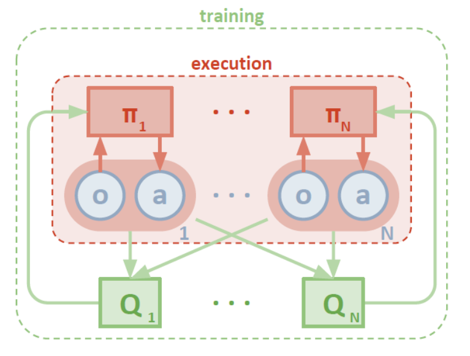
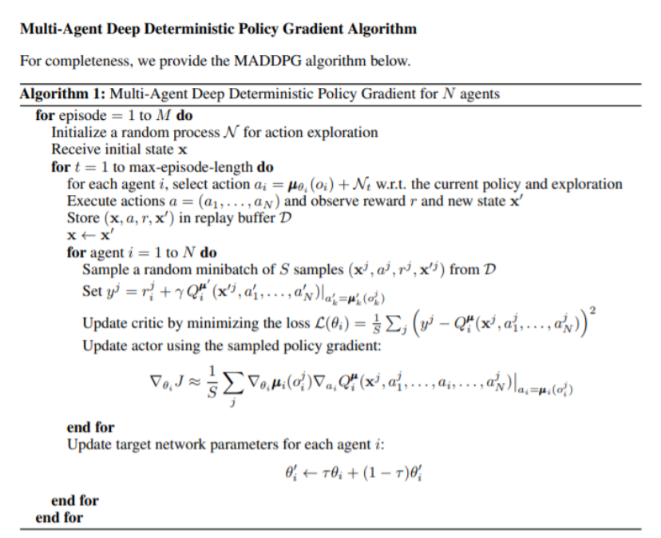
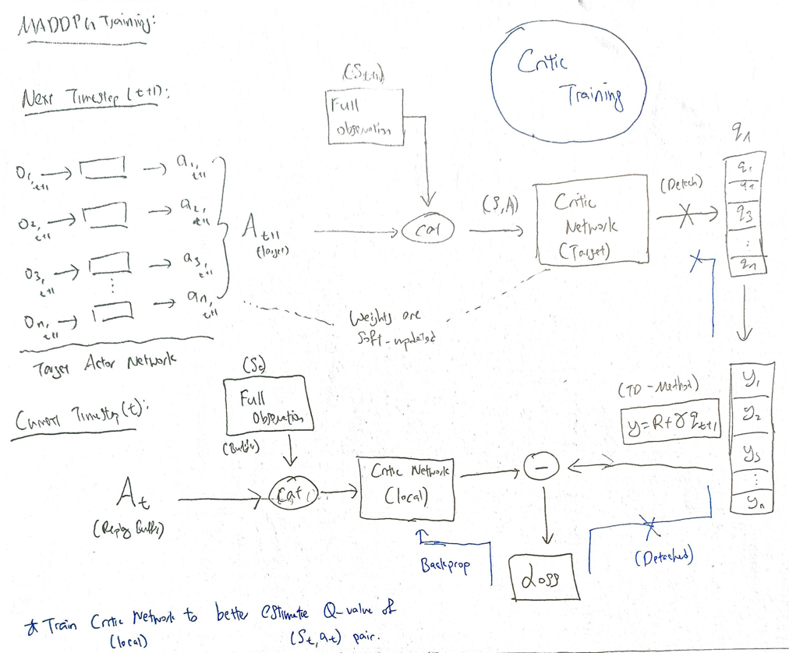
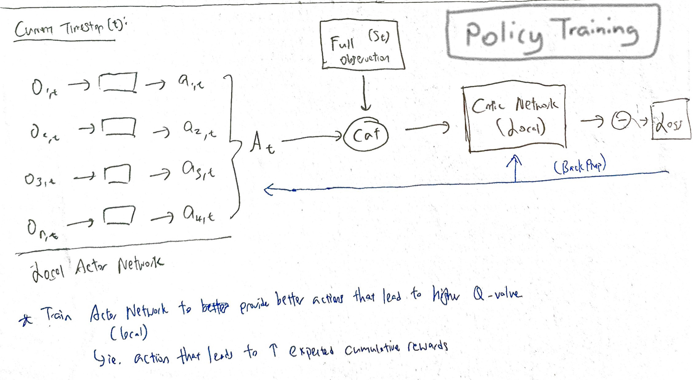
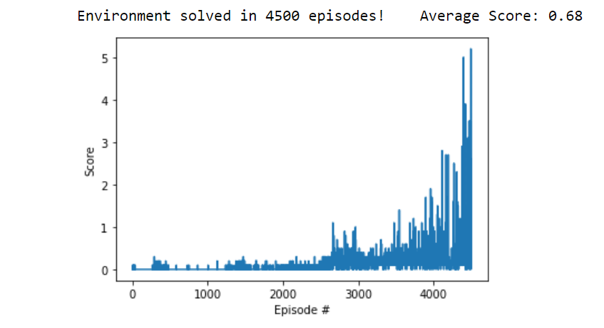

# Project 3 Report: Multi-Agent Deep Deterministic Policy Gradient (MADDPG) For Cooperative Tennis Game

  

**Note:** Please refer to the instructions on how to install this project [here](https://github.com/derektan95/deep-reinforcement-learning-udacity-nanodegree/blob/master/p3_collab-compet/INSTRUCTIONS.md).

## Summary of Content
- [MADDPG Description](#learning-algorithm)
- [Hyperparameters Chosen](#hyperparameters-chosen)
- [Results](#results)
- [Ideas for Future Work](#ideas-for-future-work)

## Learning Algorithm 
The key learning algorithm used in this project is Multi-Agent Deep Deterministic Policy Gradient (MADDPG). There are 2 main variants to MADDPG taught in this course. First, we could use a **'centralized training with decentralized execution' approach** where all agents are trained collectively in simulation but act indepdently in runtime. Secondly, we can train multiple agents using the **same DDPG network through self-play**. 

### Issue with Traditional Approaches
Traditional reinforcement learning approaches such as Q-Learning or policy gradient does not adapt well to multi-agent enviornments. Each agent's policy is changing as their own training progresses, and the environment becomes non-stationary from the perspective of any individual agent (in a way that is not explainable by changes in the agent's own policy). This results in training instabilities which may not converge as desired.

### Centralized Training With Decentralized Execution
This approach is an extension to the actor-critic policy gradient method, where the critic is augmented with extra information about the policies of all other agents. Each agent maintains their own policy network, which outputs an action with local information as input. This functions similarly to the DDPG algorithm, with the exception that the central critic network has previliged access to other agents' actions during training. As a result, **training is stabilized**. An overview of this multi-agent approach can be seen below. 

  

The pseudo-code of this approach can be seen below: 

  

Similar to DDPG, MADDPG is about training the local critic network to better estimate the true Q value of a (State, Action) pair given by all agents' policy networks. Concurrently, the local actor network is trained to provide better actions that leads to higher Q value given by the critic network. An illustration of the MADDPG training can be seen below. More information on this approach can be found [here](https://arxiv.org/pdf/1706.02275.pdf).

  
  

### Training via Self-Play
Converse to the previous approach, the same actor and critic networks are used by agents trained via self-play. In the case of MADDPG, each agent would input their own state into the same policy network to output their respective actions. These experience tuples are stored into the same experience replay buffer, which are later sampled upon during their individual training. Each agent seeks to maximize its own rewards, and can therefore be adapted to cooperative or competitive scenarios. The main gist of this approach is adapted from the AlphaZero self-play paper [here](https://arxiv.org/pdf/1712.01815.pdf). 

 

### Hyperparameters Chosen
1) **Policy-Based Actor Model:** Linear (64) - ReLU - Linear(64) - ReLU - Linear (2)
2) **Value-Based Critic Model:** Linear (64) - ReLU - Linear(64) - ReLU - Linear (1)
3) **Episodes:** 5000 
4) **Max Duration:** 10000 timesteps (Wanted to prolong gameplay) &nbsp;                  
5) **Replay Buffer Size (Max)**: 1e6         
6) **Buffer Batch Size (Sample)**: 256        
7) **Discount Factor (Gamma)**: 0.99        
8) **Target Param Update Rate (Tau)**: 1e-3        
9) **Actor Learning Rate (ADAM Optimizer)**: 1e-4
10) **Critic Learning Rate (ADAM Optimizer)**: 4e-4       
11) **Learn Every**: 20
12) **Soft Weights Update Every**: 1

### Results
The results below is obtained from my implementation of MADDPG via self-play for this project. Training achieves an **average reward (over 100 episodes) of higher than +0.5 after 4500 episodes (Average between 4400-4500)** (verify on [notebook](https://github.com/derektan95/deep-reinforcement-learning-udacity-nanodegree/blob/master/p3_collab-compet/Tennis.ipynb)). 

The main hyper-parameter that made most impact on the training progress is the network **hidden layer size** . Too many weight parameters in the hidden layers can cause difficulties in training the networks, while having too little weight parameters would result in sub-par performance due to its inability to represent and manipulate the state / action space inputs. After some experimentation, it can be concluded that a simple 2-layer network with 64 layer size each works well for this scenario.

  

### Ideas for Future Work
There are 2 possible improvements that could be made to the MADDPG algorithm, particularly for the [Centralized Training With Decentralized Execution](#centralized-Training-with-decentralized-execution) approach.

#### Agents with Policy Ensembles
In competitive scenarios, agents can derive a strong policy by overfitting to the behaviours of their competitors. Such policies are brittle and may fail when competitors alter their strategies. To achieve a more robust approach, a collection of K different sub-policies can be trained. At each episode, a particular sub-policy for each agent is executed and added to their own replay buffer. The gradient of the ensemble can factor in the gradients of all sub-policies to minimize overfitting. More information on this approach can be found [here](https://arxiv.org/pdf/1706.02275.pdf).

#### Inferring policies of other agents
The original approach assumes that each agent knows all of the other agents' policies. However, this may not be the case in reality. To counter this, each agent can main an approximation of other agents' policies. These approximate policies can be learnt by maximizing the log probability of the other agents' actions. More information on this approach can be found [here](https://arxiv.org/pdf/1706.02275.pdf).
